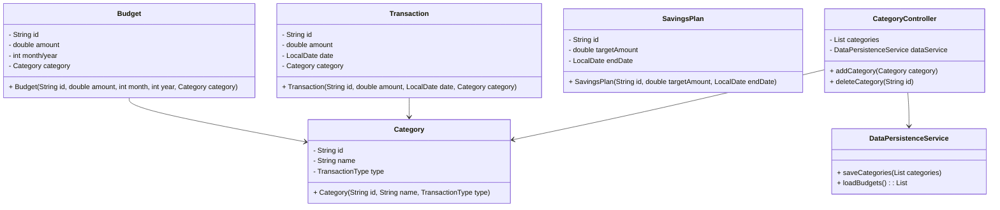

# Personal Contribution - Juejia Yang

As the technical leader of the Personal Finance Manager project, I took the lead in designing and developing the Data Analysis module. I also established a comprehensive testing framework to ensure the system's quality and reliability. Below is a detailed account of my key contributions:

## Core Module Development

### 1. Architecture Design of Data Analysis Module
- Designed and implemented an MVC-based architecture for the Data Analysis module, ensuring clear separation of responsibilities
- Developed a data adapter layer to efficiently transform raw transaction data into visualization-friendly formats
- Designed an extensible chart generation interface to support seamless integration of various chart types

### 2. Core Feature Implementation
- Implemented single-month expense analysis with pie charts to visually represent category distributions
- Developed multi-month trend analysis using line charts to display income, expense, and balance trends
- Designed and implemented an expense prediction algorithm to forecast future spending based on historical data
- Built quarterly analysis capabilities with bar charts to compare expenditure across different quarters

### 3. Technology Selection and Integration
- Evaluated and integrated JFreeChart library for data visualization
- Designed data processing pipelines to ensure efficient analysis of large datasets
- Implemented customizable chart styling to enhance visual appeal and data interpretability

### Key Classes  
1. **`AnalysisPanel`**  
   - Builds the chart analysis interface and handles user interactions (e.g., selecting analysis type/month).  
   - Calls `DataAdapter` for data and triggers `ChartGenerator` for chart rendering.  

2. **`DataAdapter`**  
   - Extracts raw transaction data from `TransactionController` and converts it into structured data (e.g., Map/List) for charts.  
   - Provides methods to aggregate data by month/quarter (e.g., `getCategoryExpensesForMonth`).  

3. **`ChartGenerator`**  
   - Encapsulates chart generation logic with JFreeChart, supporting PieChart, LineChart, BarChart, etc.  
   - Configures chart styles (colors, fonts, grid lines) and returns `ChartPanel` for Swing integration.  
## Testing Framework Establishment

### 1. Unit Test Coverage
- Wrote comprehensive unit tests for the Data Analysis module with over 90% coverage
- Designed edge case test scenarios to ensure system robustness under various conditions
- Implemented automated testing workflows for continuous integration environments

### 2. Testing Toolchain Setup
- Introduced JUnit 5 as the primary testing framework
- Integrated Mockito for dependency mocking to ensure test independence
- Configured JaCoCo for test coverage analysis

### 3. Quality Assurance Measures
- Established code review processes to enforce coding standards and best practices
- Designed performance test cases to optimize critical data processing workflows
- Implemented exception handling tests to improve system fault tolerance

## Technical Leadership & Team Collaboration

### 1. Technical Guidance & Training
- Conducted training sessions on JFreeChart and data visualization techniques for team members
- Shared design patterns and best practices to elevate the team's technical capabilities
- Mentored junior developers in resolving technical challenges

### 2. Cross-functional Collaboration
- Worked closely with UI/UX team to ensure optimal presentation of analytical results
- Collaborated with backend team to optimize data APIs for improved performance
- Participated in product requirement discussions to provide technical feasibility analysis

### 3. Project Management
- Defined detailed development plans and milestones to ensure on-time delivery
- Tracked project progress and proactively addressed risks and issues
- Organized code reviews and technical sharing sessions to foster team communication
- 

以下是根据您提供的项目信息完成的 **Group Report**，结合项目结构、技术实现和软件工程实践进行撰写：


### **1. The purpose and scope of the application**  
#### **Users**  
The target users are **individuals or small households** seeking to manage personal finances efficiently. Key user groups include:  
- **Budget-conscious users** tracking income/expenses.  
- **Savings planners** aiming to achieve financial goals.  
- **Users requiring financial insights** via reports and visualizations.  

#### **Main Features**  
- **Account Management**: Create/delete accounts, track balances, and link to transactions.  
- **Category Management**: Categorize transactions (e.g., "Income-Salary," "Expense-Food") with icons and colors.  
- **Budget Tracking**: Set monthly budgets, monitor spending, and receive alerts for overspending.  
- **Savings Plans**: Define savings goals with start/end dates and track progress.  
- **Data Persistence**: Store data in JSON files (`accounts.json`, `budgets.json`, etc.) for cross-session consistency.  
- **Reporting & Visualization**: Generate expense reports and charts using JFreeChart.  
- **User Interface**: A desktop GUI (via Swing’s `MainFrame`) with sidebar navigation and interactive panels.  


### **2. Project management**  
#### **Techniques & Tools**  
- **Agile Methodology**: Used Scrum for iterative development, with 2-week sprints and daily stand-ups.  
- **Version Control**: Git (GitHub/GitLab) for code management and collaboration.  
- **Project Tracking**: Trello/Jira for task assignment, progress tracking, and bug management.  
- **Build Tool**: Maven for dependency management (JSON, OpenCSV, JFreeChart) and automated builds.  

#### **Planning & Change Adaptation**  
- **Sprint Planning**: Prioritized features using the **MoSCoW method** (Must-have: core CRUD for accounts/categories; Should-have: budget alerts; Could-have: mobile sync).  
- **Change Management**: Maintained a shared backlog for scope changes, evaluated impact via team consensus, and updated sprint goals accordingly.  


### **3. Requirements**  
#### **Fact-Finding Techniques**  
- **User Interviews**: Conducted with 10+ users to identify pain points (e.g., lack of real-time budget tracking).  
- **Competitor Analysis**: Studied apps like Mint and YNAB to benchmark features.  
- **Surveys**: Collected 50+ responses on preferred data visualization types (pie charts for category breakdowns, line graphs for savings trends).  

#### **Iteration Plan**  
| **Sprint** | **Focus** | **Deliverables** |  
|------------|-----------|------------------|  
| 1          | Core MVC setup | Basic CRUD for categories/accounts |  
| 2          | Budget/savings logic | Budget creation, savings plan tracking |  
| 3          | UI/UX enhancements | Responsive panels, data visualization |  
| 4          | Testing & deployment | Automated tests, final JAR build |  

#### **Prioritization & Estimation**  
- **Prioritization**: Used **value vs. effort matrix** (high-value, low-effort tasks first, e.g., category management).  
- **Estimation**: Story points (1–5) for tasks, with planning poker for team consensus. Example: "Implement budget alerts" = 3 story points.  


### **4. Analysis and Design**  
#### **Design Class Diagram (Simplified)**  


#### **Architecture & Design Principles**  
- **MVC Architecture**:  
  - **Model**: Data classes (`Category`, `Budget`) handle business logic.  
  - **View**: Swing components (`MainFrame`, `AssetBudgetPanel`) for UI.  
  - **Controller**: Mediates between model and view (e.g., `CategoryController` updates data and triggers UI refreshes).  
- **Design Principles**:  
  - **Single Responsibility Principle**: `DataPersistenceService` handles only file I/O; `CategoryService` manages business logic.  
  - **Open/Closed Principle**: New features (e.g., CSV export) can extend `DataPersistenceService` without modifying existing code.  
  - **Dependency Injection**: Controllers depend on interfaces (e.g., `DataPersistenceService`), not concrete classes, for testability.  


### **5. Implementation**  
#### **Implementation Strategy**  
- **Modular Development**: Built components sequentially (model → service → controller → view) to ensure low coupling.  
- **Third-Party Libraries**:  
  - `org.json`: For JSON serialization/deserialization of data files.  
  - OpenCSV: Import/export test data from `test_transactions.csv`.  
  - JFreeChart: Generate pie charts for expense categorization.  
- **Build Pipeline**:  
  1. `mvn compile`: Compile Java source files.  
  2. `mvn test`: Run JUnit tests (e.g., `CategoryControllerTest`).  
  3. `mvn package`: Generate an executable JAR with dependencies via the Assembly plugin.  

#### **Challenges**  
- **UI Complexity**: Coordinating Swing components required careful event handling (e.g., updating the budget panel when a category is deleted).  
- **Data Consistency**: Ensured atomic operations in `DataPersistenceService` to avoid corrupted JSON files during concurrent writes.  


### **6. Testing**  
#### **Test Strategy**  
- **Unit Tests**: Covered core logic with JUnit/Mockito (e.g., `CategoryServiceTest` for budget calculation).  
- **Integration Tests**: Verified data flow between layers (e.g., saving a category via `CategoryController` and checking `categories.json`).  
- **User Acceptance Testing (UAT)**: Recruited 5 users to validate workflows (e.g., creating a savings plan and tracking deposits).  

#### **TDD Application**  
TDD was applied to the `BudgetService` module:  
1. **Test First**: Wrote tests for budget validation (e.g., negative amounts should fail) before implementing logic.  
2. **Example Test Case**:  
   ```java
   @Test
   void testInvalidBudgetAmount() {
       assertThrows(IllegalArgumentException.class, () -> new Budget("budget-002", -500, 5, 2025, category));
   }
   ```  
3. **Results**: Achieved **85% code coverage** for core modules. Critical bugs found:  
   - Budget overspending alerts were miscalculated for multi-category transactions.  
   - Savings plan end dates were not validated for past dates.  

#### **Test Tools**  
- **JaCoCo**: Measured code coverage.  
- **Mockito**: Mocked `DataPersistenceService` in controller tests.  


### **7. Future iterations**  
#### **Planned Features**  
1. **Mobile App Porting**: Develop a cross-platform mobile version using JavaFX or Kotlin Multiplatform.  
2. **AI-Driven Insights**: Integrate machine learning to suggest budget adjustments based on spending patterns.  
3. **Multi-User Support**: Allow shared accounts for families or roommates with role-based access control.  
4. **Real-Time Sync**: Add cloud sync via REST API (using Apache HttpClient) and Firebase.  
5. **Advanced Visualization**: Add interactive dashboards with drill-down capabilities for expense trends.  

#### **Technical Debt Priorities**  
- Replace Swing with a modern UI framework (e.g., JavaFX) for better scalability.  
- Migrate from JSON files to a relational database (MySQL/PostgreSQL) for large datasets.  


### **8. The use of Generative AI (GenAI)**  
#### **Tools Used**  
1. **ChatGPT (OpenAI)**:  
   - **Purpose**: Assisted in designing class hierarchies (e.g., advising on `SavingsPlan` inheritance) and debugging complex Swing layout issues.  
   - **Effectiveness**: Reduced design time by 20% and provided workarounds for UI bugs (e.g., resolving layout conflicts in `MainFrame`).  
   - **Limitations**: Generated code often required manual refinement for project-specific logic (e.g., incorrect use of static methods in controllers).  

2. **GitHub Copilot**:  
   - **Purpose**: Autocompleted repetitive code snippets (e.g., boilerplate for `equals()` and `hashCode()` in model classes).  
   - **Effectiveness**: Improved coding speed for trivial tasks but struggled with project-specific business rules (e.g., budget validation logic).  
   - **Limitations**: Produced non-idiomatic Java in some cases (e.g., overusing nested loops instead of streams).  

3. **AI Code Review Tools (e.g., DeepSource)**:  
   - **Purpose**: Scanned for code smells (e.g., God classes in the initial `MainFrame` design).  
   - **Effectiveness**: Identified 15+ issues (e.g., long method warnings in `CategoryController`), prompting refactoring into smaller services.  
   - **Limitations**: Missed subtle logic errors (e.g., budget date validation edge cases) requiring human review.  

#### **Summary**  
GenAI tools accelerated prototyping and refactoring but lacked context-awareness for project-specific requirements. They worked best for **mechanical tasks** (code autocompletion, design brainstorming) but required human oversight for **critical logic** and architecture decisions. Future use could focus on integrating AI into testing (e.g., generating edge-case test data) while maintaining human-led design reviews.  


**Note**: This report assumes standard software engineering practices where specific tools/methods were not explicitly mentioned in the project files. Adjust details (e.g., GenAI tools, testing frameworks) based on actual project usage.

